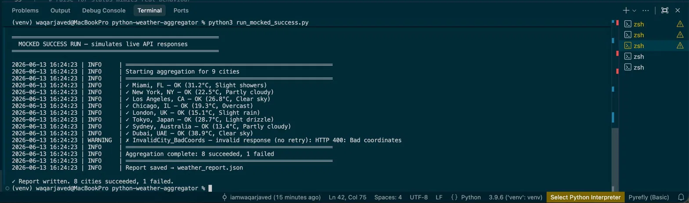
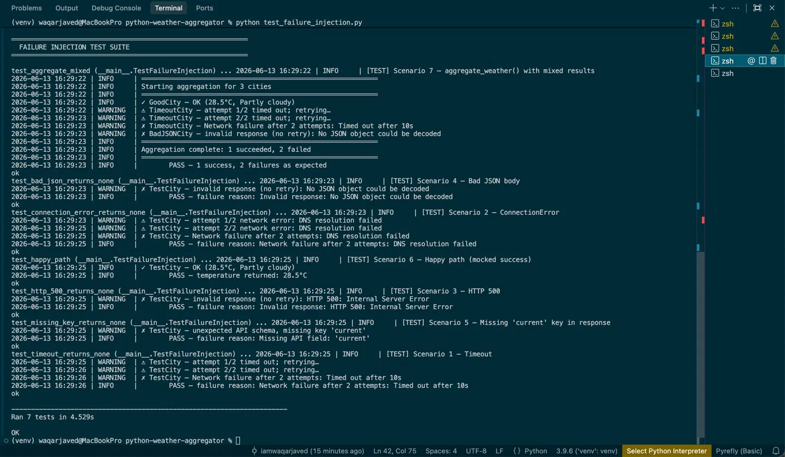
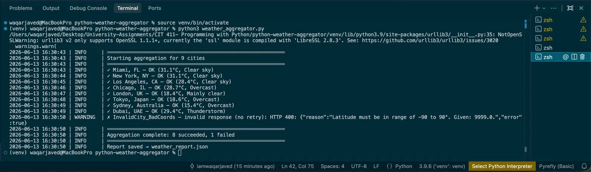

# Python Weather Data Aggregator

A production-style Python program that pulls current weather for multiple
cities from the [Open-Meteo API](https://open-meteo.com/) (free, no API key
required), handles every realistic failure mode gracefully, and writes a
structured JSON report.

Built as **Module 4 — Lab 4** of a CS practicum, but designed to teach
real-world patterns anyone can use.

---

## What you'll learn

- How to structure a Python project with `config.py` and `.env` separation
- The difference between a "raw" I/O function and a safe wrapper
- When to retry vs. fail fast on different error types
- How to use Python's `logging` module correctly (INFO / WARNING / ERROR)
- How to test network failure paths using `unittest.mock.patch`
- How to write structured JSON reports with timestamps

---

## Project structure

```
weather_aggregator/
├── weather_aggregator.py   # Core logic: fetch, aggregate, save
├── config.py               # All tuneable settings and city list
├── .env.example            # Template for secrets (copy to .env)
├── test_failure_injection.py  # 7 failure scenarios, all mocked
├── run_mocked_success.py   # Full demo run without real network
├── weather_report.json     # Sample output
└── ERROR_HANDLING_DOCS.md  # 1-page design decisions reference
```

---

## Quickstart

### 1. Clone and enter the project

```bash
git clone https://github.com/YOUR_USERNAME/python-weather-aggregator.git
cd python-weather-aggregator
```

### 2. Create a virtual environment

```bash
python -m venv venv

# Mac/Linux:
source venv/bin/activate

# Windows:
venv\Scripts\activate
```

### 3. Install dependencies

```bash
pip install requests python-dotenv
```

### 4. Set up your `.env`

```bash
cp .env.example .env
# No changes needed for Open-Meteo — it's free with no key
```

### 5. Run the demo (no internet required)

```bash
python run_mocked_success.py
```

You should see:

```
2026-06-13 20:03:02 | INFO     | ✓ Miami, FL — OK (31.2°C, Slight showers)
2026-06-13 20:03:02 | INFO     | ✓ New York, NY — OK (22.5°C, Partly cloudy)
...
2026-06-13 20:03:02 | WARNING  | ✗ InvalidCity_BadCoords — invalid response (no retry): HTTP 400
2026-06-13 20:03:02 | INFO     | Aggregation complete: 8 succeeded, 1 failed
2026-06-13 20:03:02 | INFO     | Report saved → weather_report.json
```

### 6. Run the live API (internet required)

```bash
python weather_aggregator.py
```

Open-Meteo is free and requires no account or key. A real `weather_report.json`
and `weather_aggregator.log` are written to disk.

### 7. Run the failure injection tests

```bash
python test_failure_injection.py
```

Expected output: `Ran 7 tests in ~4.5s — OK`

---

## Architecture: three-layer error containment

```
fetch_weather()          ← Layer 1: pure I/O, always raises on failure
      ↓
fetch_weather_safe()     ← Layer 2: catches & classifies, returns (data, failure)
      ↓
aggregate_weather()      ← Layer 3: orchestrates all cities, never crashes
```

The key insight: keeping the raw function "pure" (no try/except) means it's
easy to unit-test and reuse. All defensive code belongs in the wrapper.

---

## Error handling decisions

| Error type | Retry? | Why |
|---|---|---|
| `requests.Timeout` | Yes | Transient — a slow server often recovers |
| `requests.ConnectionError` | Yes | Transient — DNS hiccups usually resolve |
| HTTP 4xx / 5xx | No | Deterministic — same request = same broken response |
| Bad JSON body | No | Deterministic — retrying delivers the same garbage |
| Missing API field | No | API contract changed — retrying won't add the key |

---

## Switching to a key-required API

This is a one-line change. In `.env`:

```
WEATHER_API_KEY=your_key_here
WEATHER_API_BASE_URL=https://api.someotherprovider.com/v1/current
```

The `fetch_weather()` function already reads both variables and attaches the
key as a `Bearer` header when present.

---

## Sample report output

```json
{
  "generated_at": "2026-06-13T20:03:02.303632+00:00",
  "summary": { "total": 9, "succeeded": 8, "failed": 1 },
  "weather_data": [
    {
      "city": "Miami, FL",
      "temperature_c": 31.2,
      "humidity_pct": 82,
      "wind_speed_kmh": 18.0,
      "weather_desc": "Slight showers",
      "observation_time": "2026-06-13T20:00"
    }
  ],
  "excluded": [
    {
      "city": "InvalidCity_BadCoords",
      "reason": "Invalid response: HTTP 400: Bad coordinates"
    }
  ]
}
```

### Successful run (mocked)
Simulates live API responses for all 8 cities — no internet required.



8 cities return `INFO` with temperature and condition. `InvalidCity_BadCoords`
triggers a `WARNING` with `invalid response (no retry): HTTP 400` and is
written to the `excluded` list in the report. Total runtime: instant.

---

### Failure injection test suite
All 7 error scenarios exercised via `unittest.mock.patch` — no real network calls.



Each scenario logs at `WARNING` level with a structured reason string.
Timeout scenarios show the retry behavior (attempt 1/2 → attempt 2/2 → final failure).
Deterministic errors (bad JSON, HTTP 500, missing key) fail immediately with no retry.
Result: `Ran 7 tests in 4.529s — OK`

---

### Live API run
Real HTTP calls to Open-Meteo — actual current weather data.



Notice the real temperatures differ from the mocked run (Miami 31.1°C vs 31.2°C,
London 18.4°C vs 15.1°C, Dubai 29.4°C with Thunderstorm). `InvalidCity_BadCoords`
fails with the actual Open-Meteo error: `Latitude must be in range of -90 to 90.
Given: 9999.0` — exactly the kind of descriptive API error the handler captures
and logs without crashing the program.


---

## Extending this project (ideas)

- Add a `--city` CLI flag using `argparse` to query a single city on demand
- Schedule it with `cron` or Windows Task Scheduler to run hourly
- Push the JSON report to an S3 bucket or Google Sheet
- Add a Slack webhook notification when any city fails
- Swap Open-Meteo for Tomorrow.io or WeatherAPI with just `.env` changes
- Add a simple Flask endpoint that serves the latest report as an API

---

## License

MIT — use it, fork it, build on it.